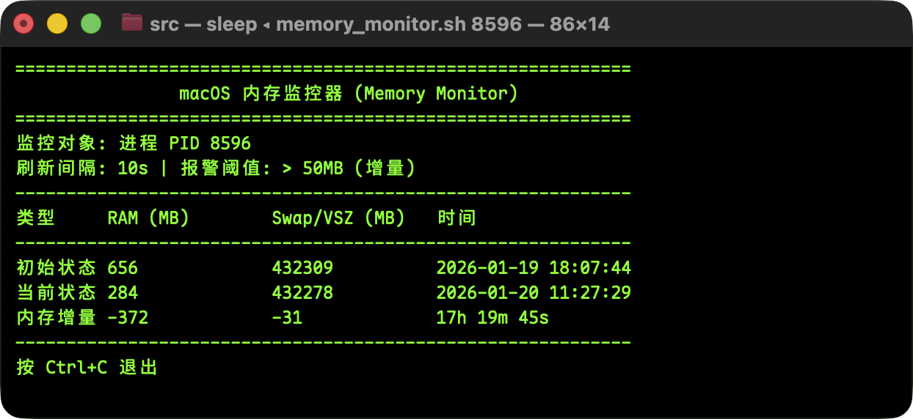

# 内存监控器 (Memory Monitor)

一个轻量级的 macOS 命令行工具，用于实时监控系统或指定进程的内存使用情况。

## 功能
- **实时监控**: 每10秒刷新系统 RAM/Swap 或指定进程的 RSS/VSZ。
- **增量显示**: 自动计算并显示相对于启动时的内存增量。
- **智能高亮**: 当内存增量超过阈值 (默认 50MB) 时，使用红色高亮警示。
- **零依赖**: 纯 Shell 脚本编写，无需安装 Python 或其他库。
- **双模式支持**: 既支持监控系统整体内存，也支持监控特定进程。

## 界面预览



## 使用方法

### 1. 监控系统整体内存
不带参数运行，默认监控系统整体内存使用情况：
```bash
./src/memory_monitor.sh
```

### 2. 监控特定进程
在命令后跟上进程 ID (PID)：
```bash
./src/memory_monitor.sh <PID>
```
例如：
```bash
./src/memory_monitor.sh 12345
```

## 界面说明
工具启动后会在固定区域刷新显示三行数据：
- **初始状态**: 脚本启动时的内存快照。
- **当前状态**: 实时内存数据 (每10秒更新)。
- **内存增量**: (当前 - 初始)，如果 RAM 增量超过 50MB 会变红警告。

### 显示内容说明
- **系统模式**: 显示 RAM (活跃+线程+压缩内存) 和 Swap (交换空间) 使用量
- **进程模式**: 显示 RSS (实际物理内存) 和 VSZ (虚拟内存大小)

## 配置
可在脚本开头修改以下参数：
- `THRESHOLD_MB`: 增量报警阈值，默认 50MB
- `INTERVAL`: 刷新间隔，默认 10秒

## 开发
请参考 [spec.md](spec.md) 查看技术规格。
